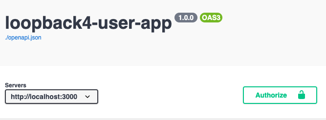

## Part 4: Putting it Together

### Step 1: Prepare API Explorer to test JWT Authentication

In order to test JWT authentication in the API Explorer (to specify the Authorization header), there are extra steps needed. See docs page: https://loopback.io/doc/en/lb4/Authentication-Tutorial.html#specifying-the-security-settings-in-the-openapi-specification

1. Create `utils/security-spec.ts` with content:

```ts
import {SecuritySchemeObject, ReferenceObject} from '@loopback/openapi-v3';

export const OPERATION_SECURITY_SPEC = [{bearerAuth: []}];
export type SecuritySchemeObjects = {
  [securityScheme: string]: SecuritySchemeObject | ReferenceObject;
};
export const SECURITY_SCHEME_SPEC: SecuritySchemeObjects = {
  bearerAuth: {
    type: 'http',
    scheme: 'bearer',
    bearerFormat: 'JWT',
  },
};
```

2. In `user.controller.ts`,
   Add import:

   ```ts
   import {OPERATION_SECURITY_SPEC} from '../utils/security-spec';
   ```

   For the endpoints that you want to add security spec:

   ```ts
     @get('/users/count', {
       security: OPERATION_SECURITY_SPEC, // add this line
       responses: {
         '200': {
           description: 'User model count',
           content: {'application/json': {schema: CountSchema}},
         },
       },
     })
     async count(
       @param.query.object('where', getWhereSchemaFor(User)) where?: Where<User>,
     ): Promise<Count> {
       //...
     }
   ```

3. In `application.ts`, add the following:


    ```ts
    //add/modify import
    import {SECURITY_SCHEME_SPEC} from './utils/security-spec';
    import {ApplicationConfig, BindingKey} from '@loopback/core';

    /**
     * Information from package.json
    */
    export interface PackageInfo {
      name: string;
      version: string;
      description: string;
    }
    export const PackageKey = BindingKey.create<PackageInfo>('application.package');

    const pkg: PackageInfo = require('../package.json');
    ```

    Inside constructor:

    ```ts
    this.api({
      openapi: '3.0.0',
      info: {title: pkg.name, version: pkg.version},
      paths: {},
      components: {securitySchemes: SECURITY_SCHEME_SPEC},
      servers: [{url: '/'}],
    });
    ```

### Step 2: Testing

Start the application with `npm start` command. Go to the API Explorer: http://localhost:3000/explorer

You should see the "Authorize" button at the top of the API Explorer.


1. Create user using `/users/signup`
2. Log in using `/users/login`. After you log in, copy the returned token
3. Click Authorize at the top of API Explorer, paste the token you got in the previous step.
4. You now can call other endpoints.
